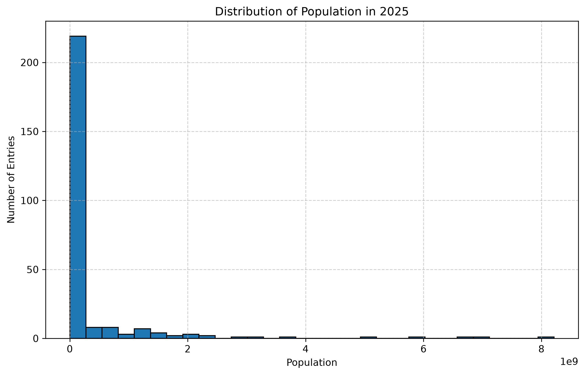
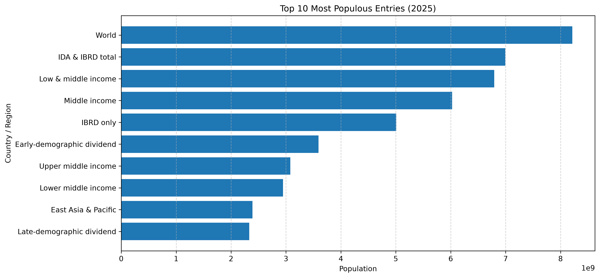

# SkillCraft Technology - Data Science Internship

## Task 1: Population Distribution Visualization

### Project Overview

This project is part of the SkillCraft Technology Data Science Internship.

The objective is to explore the World Bank Population Dataset, perform basic data preprocessing, conduct exploratory data analysis (EDA), and visualize the distribution of population values using Python.

---

## Objective

- Load the World Bank Population Dataset
- Clean and preprocess the data
- Perform Exploratory Data Analysis (EDA)
- Visualize the distribution of population values
- Interpret the results

---

## Dataset

- Source: World Bank Population Dataset
- Population data from **1960–2025**
- Total records after cleaning: **264**

---

## Technologies Used

- Python
- Pandas
- NumPy
- Matplotlib
- Jupyter Notebook

---

## Project Structure

```
SCT_DS_1/
│── data/
│── images/
│── notebooks/
│── src/
│── README.md
```

---

## Visualizations

### Population Distribution Histogram



### Top 10 Most Populous Entries



---

## Key Insights

- Most entries have relatively small populations.
- The population distribution is highly right-skewed.
- The dataset contains both countries and aggregate entities.
- A few entries dominate the overall population values.

---

## Conclusion

This project demonstrates the complete workflow of loading, cleaning, analyzing, and visualizing real-world population data using Python. It highlights fundamental data analysis techniques that are commonly used in data science projects.

---

## Author

**Saivarun**

- GitHub: https://github.com/varun99638